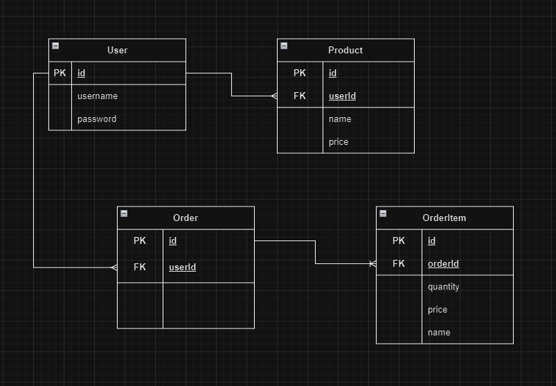
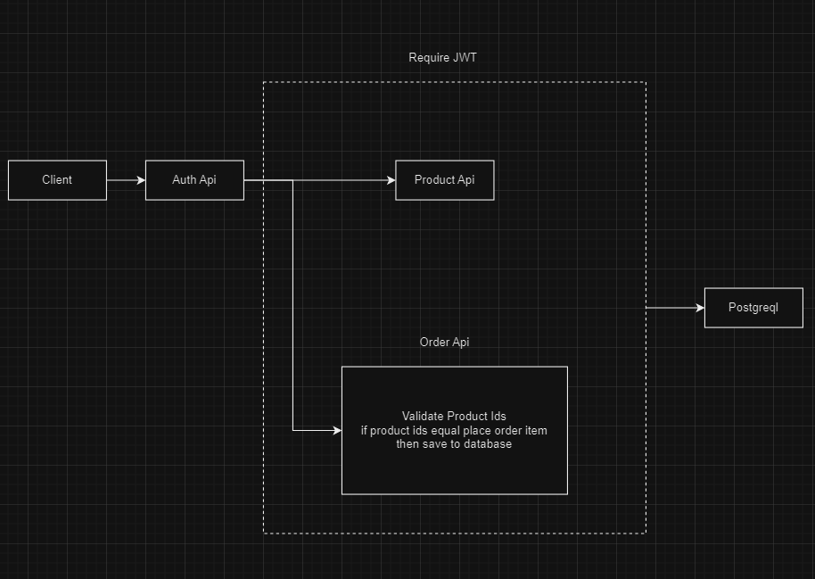

# Ecommerce apis

## run docker compose

```
docker compose up -d
```

## Create Database

http://localhost:8080
```
Server: db
Username: postgres
Password: password!1

then create database name: ecommerce
```

## migrations
```
npm i

npm run migration:run 
```

restart apis services if all good >> http://localhost:5000/api


## ER diagram


## System architecture
